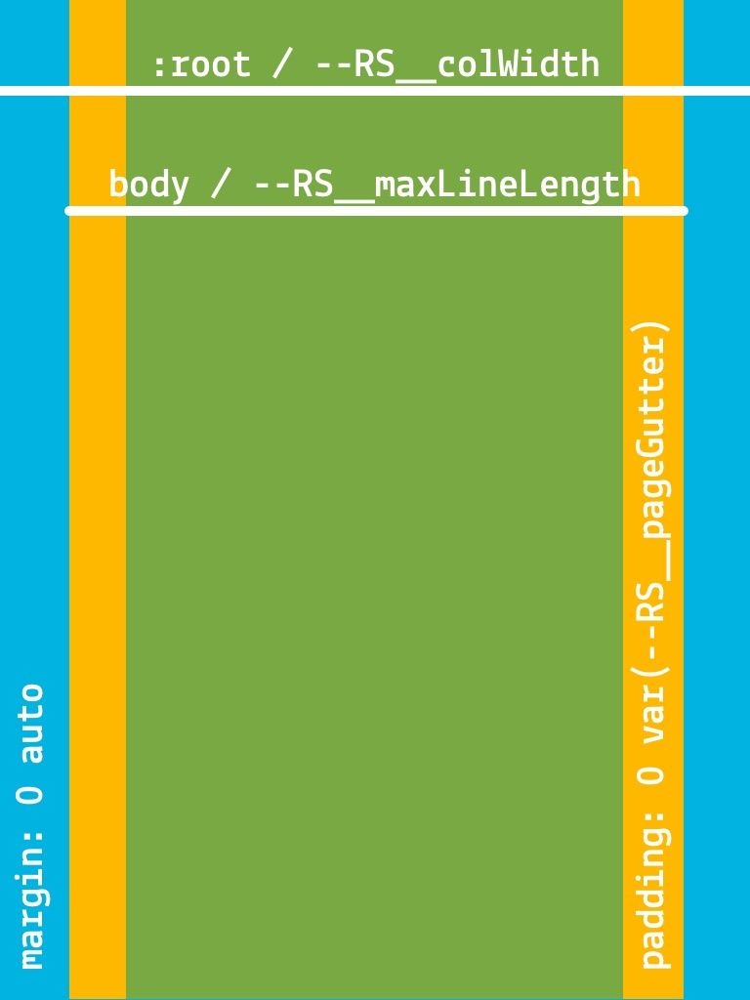
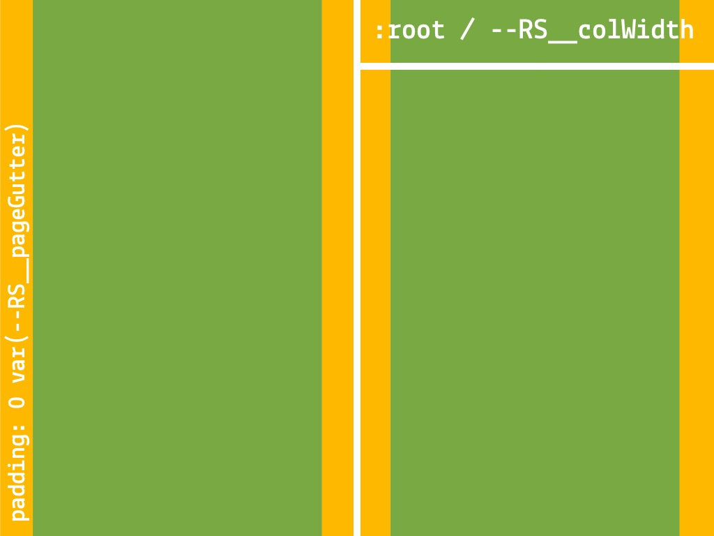

# Inject and paginate EPUB contents

[Implementers’ doc] [Authors’ info] [WIP]

## Injection

Depending on the platform and version you’re developing for, contents must be injected into: 

- a web view;
- a chrome view;
- an iframe.

Indeed, we must provide authors with a reliable context in which their styles and scripts are scoped.

### Margins and dimensions

Since we must take viewport units into account, especially `vh` (viewport height), at least the top and bottom margins must be set on this container, and not inside it.

You may also want to set left and right margins on this container so that all margins are equal in the two-column view.

Finally, on larger screens, you’ll have to set dimensions on this container so that it doesn’t become too large.

### Background color

Please note you must deal with the `background-color` outside this container, especially as the user can set reading modes (night, sepia, etc.). In other words, it must be synced with this user setting so that the entire screen is the same `background-color`.

As a friendly reminder, you can allow transparency for the iframe if you’re using one. That should help deal with `background-color` at the global level.

```
<iframe src="source.xhtml" allowtransparency="true"></iframe>
```

Then set the `--RS__backgroundColor` variable to `transparent` in `ReadiumCSS-base.css`, although you will have to modify the current user settings stylesheet so that it can work this way.

## Pagination

Contents are paginated using [CSS multicolumns](https://www.w3.org/TR/css3-multicol/), for several reasons: 

- [it’s been cross-platform for a long time](http://caniuse.com/#feat=multicolumn);
- it’s responsive;
- it’s tried and tested;
- it brings some kind of interoperability since it has been used by a lot of Reading Systems and authors have been designing against them.

### Default

Pagination is responsive by default, which means it is using relative values in order to adapt layout to the viewport and the current font size.

We’ve chosen this approach since it appears setting everything in pixels is more likely to create rounding errors and rendering issues (e.g. cut-off text) than letting the rendering engine deal with relative units on its own.

The responsive design provides other benefits. For instance, if the reader is using an iPad in landscape mode and sets a bigger font size, the two-column view will automatically switch to a single-page view if needed.

You can also limit line-length by setting a `max-width` for `body`.

Please note a user setting for the number of columns has been designed so that users can set the layout as they wish.

### The RS owns :root and part of body

Since we must inject contents and columns are implemented at the `:root` level (i.e. `html`), the Reading System owns the entire styling for this selector.

Font size is an important metric since the responsive design relies entirely on `rem` (root `em`) so this style must be enforced by any means necessary.

For `body`, we own: 

- `overflow`;
- sizing: `(min-|max-)width`, `(min-|max-)height`, `box-sizing`;
- spacing: `margin` and `padding`.

You can control horizontal margins in several ways: 

1. using `column-gap` and `padding` for `:root`;
2. using `column-gap` and `margin` for the web view/chrome view/iframe;
3. using `padding` for `:root` and/or `body`.

Please note that when using `padding`, you must take it into account when sizing `:root` and/or `body`. Their widths contain the padding set for the element.

### The auto pagination model

The following illustrations are the two models you’ll have to deal with.



A single page is just a column which can grow to the entire width of the web view/iframe since it is declared for `html`.

Page margins are part of `body`, hence `--RS__maxLineLength`. Contents are centered using the `auto` value for `body` margins.



In the spread model, i.e. two columns, the `--RS__colWidth` is a floor: once the minimum width available can’t contain 2 columns (the value is computed from the `font-size` user setting), we switch to the single page model.

Since we don’t limit line-length anymore, you might want to limit the web view/iframe size so that you don’t end up with wide columns on large screens (or add `padding` to `root` and take it into account when scrolling).

#### Variables you can set

Please note those variables’ value can be redefined using media queries. You don’t need to redeclare entire declarations.

```
--RS__colWidth
```

The optimal column’s width. It serves as a floor in our design.

```
--RS__colCount
```

The optimal number of columns (depending on the columns’ width).

```
--RS__colGap
```

The gap between columns. It must be set in pixels so that it won’t resize with font size. 

You must account for this gap when scrolling.

```    
--RS__pageGutter
```

The horizontal page margins. It must be set in pixels so that it won’t resize with font size.

```
--RS__maxLineLength
```

The optimal line-length. It must be set in `rem` in order to take `:root`’s `font-size` as a reference, whichever the `body`’s `font-size` might be.

### Patch and safeguards

We’ve designed two extras for pagination: 

1. a patch for HTML5 Suggested Rendering, which takes care of paged media;
2. safeguards, which make sure some elements will be managed as expected by authors in columns.

#### Patch

The HTML5 patch deals with: 

- fragmentation (`widows`, `orphans` and `page-break`);
- hyphenation;
- open type features;
- horizontal margins (pixels have been converted to %);
- normalization of `abbr` and `wbr`.

You can use it with or without pagination, it should not make any difference.

#### Safeguards

Safeguards deal with:

- media sizing (e.g. `img`, `svg`, `audio`, `video`);
- word wrap for long strings (headings and links);
- large table’s overflow.

Once again, you can use it with or without pagination, it should not make any difference.

##### Variables you can set

```
--RS__maxMediaWidth
```

The `max-width` for media elements i.e. `img`, `svg`, `audio` and `video`.

```
--RS__maxMediaHeight
```

The `max-height` for media elements i.e. `img`, `svg`, `audio` and `video`.

```
--RS__boxSizingMedia
```

The box model (`box-sizing`) you want to use for media elements.

```
--RS__boxSizingTable
```

The box model (`box-sizing`) you want to use for tables.
